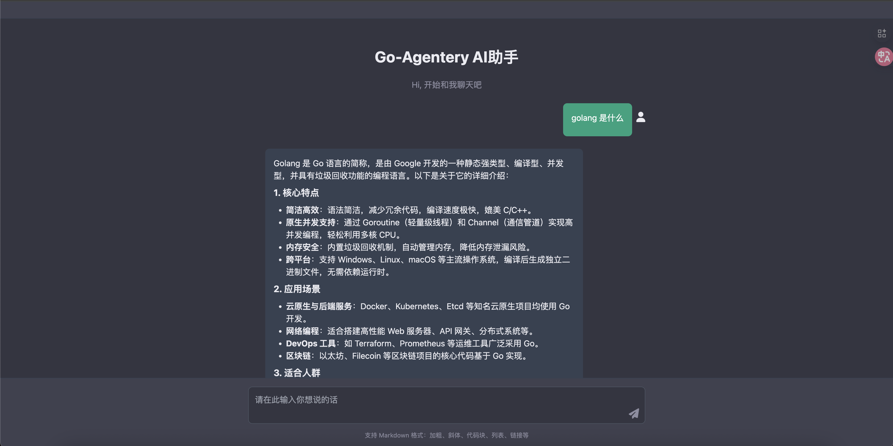

# go-agentery

基于 CloudWeGo Eino 的 Go 语言 AI 助手项目，提供 Web 端对话界面，支持 SSE 流式回复与工具调用。

## 功能
- SSE 实时流式输出：服务端逐 token 推送，前端即时渲染
- 多工具能力：时间、定位、天气查询（基于高德地图 API）
- 对话记忆：按 session 维护消息历史
- Web UI：支持 Markdown 与代码高亮，内置简单聊天体验

## 快速开始
1. 设置环境变量（必需）
   - `ARK_KEY`: 火山方舟模型 API Key
   - `GAODE_KEY`: 高德地图 API Key（定位/天气工具依赖）
2. 运行服务
   - `go run .`
3. 打开浏览器访问
   - `http://127.0.0.1:5678`

## 项目结构
- `main.go`：HTTP 服务、SSE 输出、会话管理与页面入口
- `agent.go`：Eino Agent/Runner 初始化，注册工具
- `model/model.go`：火山方舟模型创建（默认 `doubao-seed-1-8-251228`）
- `mytool/time_tool.go`：时间工具
- `mytool/location_tool.go`：定位工具（基于 IP + 高德）
- `mytool/weather_tool.go`：天气工具（基于高德）
- `chat.html`：前端聊天页面

## 接口说明
- `GET /`：返回聊天页面
- `GET /chat?msg=...&session=...`：SSE 流式对话接口

## 效果图

